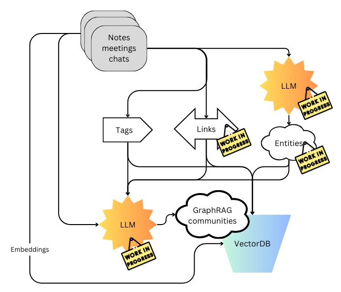

# ragyva

my personal take on RAG to manage my personal notes

I manage my notes in VSCode and started on a [syster repo to implement a VScode extension](https://github.com/yarmand/ragyva-vscode) that leverage ragyva.

## install and requirements

### devcontainer

lets use the devcontainer, it will install everything and will serve as base for final distribution.

start it with VSCode or run

```
devcontainer up --workspace-folder $(pwd)
```

### ollama

Altertanive 1:
run [ollama](https://ollama.com/) on your machine.

Alternative 2:
run Ollamma in docker-compose

```
docker compose up -d ollama
```

### models

Make sure you have the models listed in config.ini. so for `nomic-embed-text`

```
ollama pull nomic-embed-text
```

Update the config to show whatever models you want to use.
A good small model for chat is `phi3:instruct`

```
ollama pull phi3:instruct
```

## import notes

```
find ./docs -name '*.md' | import.py
```

(see details with `import.py -h`)

## chat with notes

```
chat.py
```

# Architecture and design
The ingestion extract tags, links and entities to inform the creation of graphRAG communities. (see [graphRAG paper](https://arxiv.org/abs/2404.16130))


(diagram [source on canva](https://www.canva.com/design/DAGS8zlwqcU/lYF-m0gO87c1ErFMvkGvHA/edit?utm_content=DAGS8zlwqcU&utm_campaign=designshare&utm_medium=link2&utm_source=sharebutton))

# TODO

- implement communities from graphRAG: <https://github.com/microsoft/graphrag>

## improve import

- ~~only import files that changes since last embedding cycle~~ => store import time as matadatas
- ~~find the right balance of chunk size~~ => use markdown langchain markdown splitter
- ~~user relative path for notes~~
- add significant meta-data
  - ~~note / file the chunk is coming from~~
  - significant objects found in the chunk
    - dates
    - people
    - ~~tags~~
- Embed Images
  - describe images
  - extract keywords from diagram
- graphDB associated with notes
  - significant meta-data
  - references from note to notes (wiki links)
  - link the grapRAG communities

## improve chat

- Every chat interaction should not trigger a retrieval. When initial query is done, following interactions do not
  necessarily need more data.
- Analyse the prompt to determine if a retrieval is necessary or not.

## improve retrieval

- ~~print path of note retreived~~
- retreive chunk before and after the return by vector DB
- return full note instead of chuncks as an option
- optimize model temperature on retreival filter
- add layer to filter returned data and eliminate not relevant
- Analyse prompt to distinguish content questions from dataset question (ex: how many documents with ...)

## improve generation

- prompt engineering on template.
  - where to put hte retreived data
  - where to insert the user query
- optimize model temperature on response generation

## Notes Agents

- Allow to perform actions on notes
- Input then organize
  - user to free input of note
  - on save, analyse and propose to organise note following PARA ( Projects, Areas, Resources, Archives)
